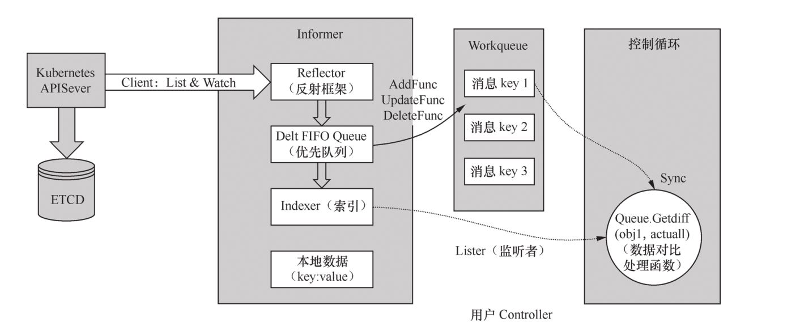
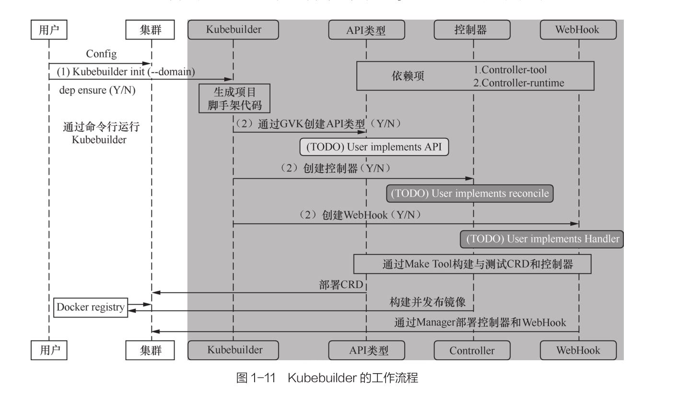
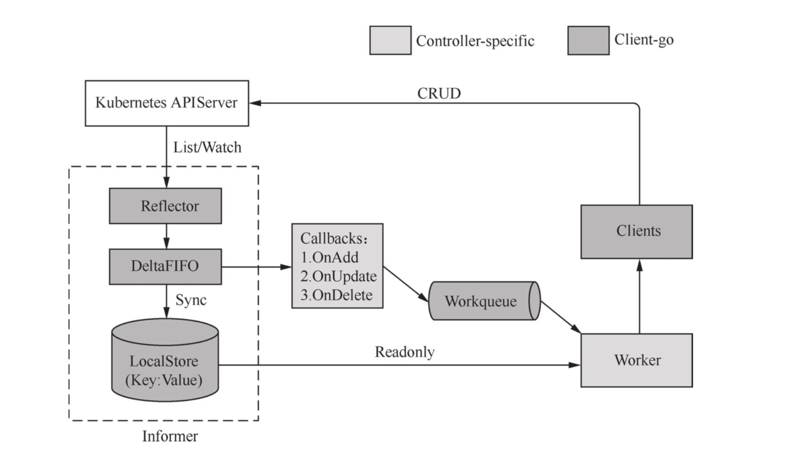
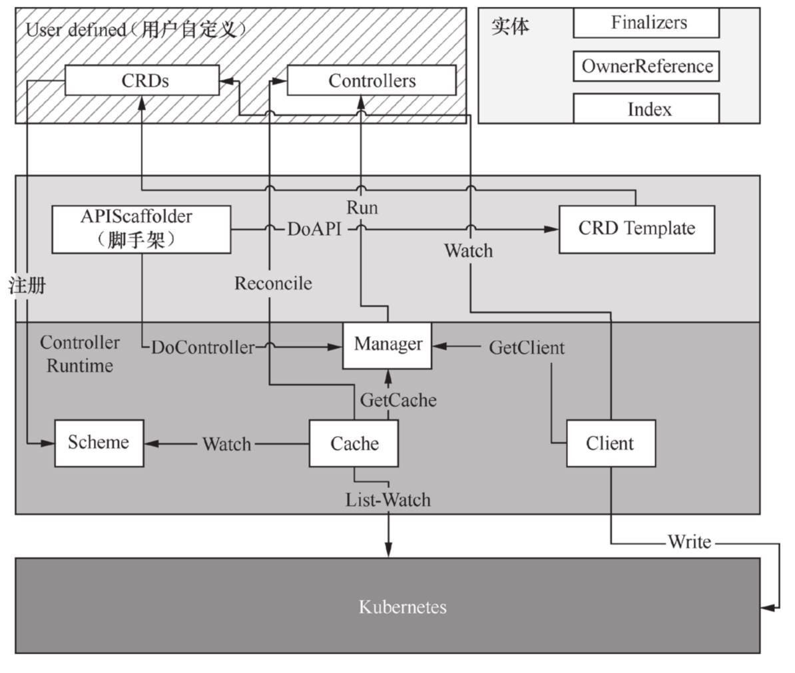
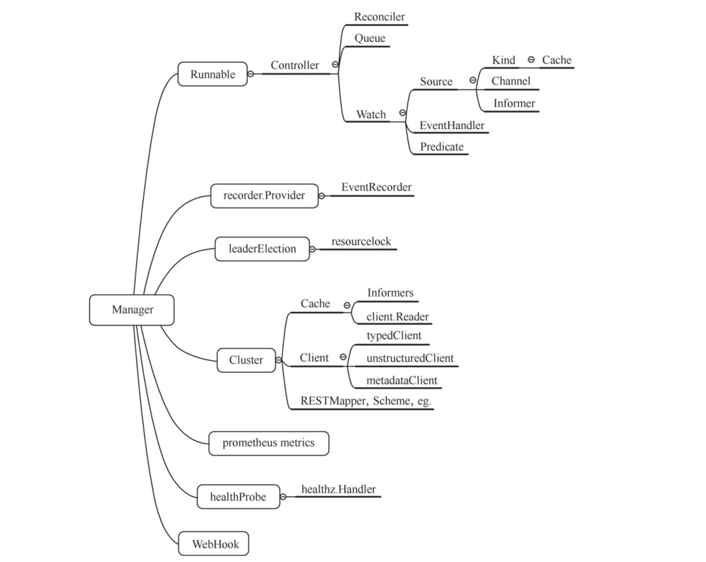
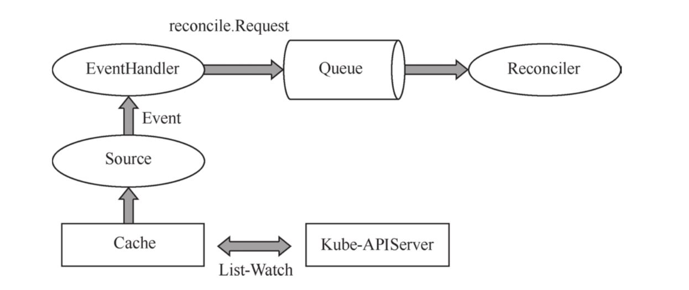
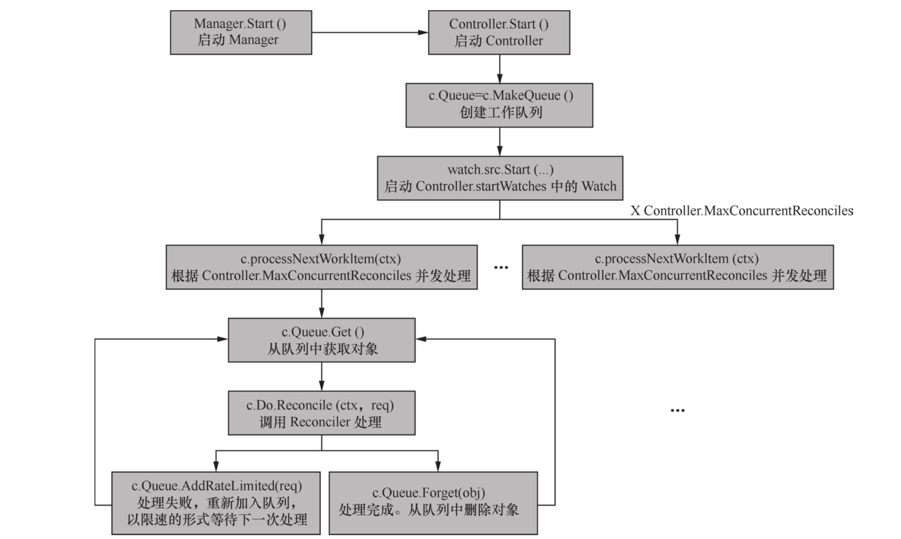

<p align="center">
	
</p>

```
Operator 的运行机制是作为自定义扩展资源注册到
Controller Manager，通过 List-Watch 的方式监听对应资源的变化，然后在周期内的
各个环节进行相应的协调。
```

### kubeoperator

<p align="center">
	
</p>

```
https://go.kubebuilder.io/introduction.html

curl -L -o kubebuilder https://go.kubebuilder.io/dl/latest/$(go env GOOS)/$(go env GOARCH)
chmod +x kubebuilder && sudo mv kubebuilder /usr/local/bin/

mkdir demo
cd demo
go mod init github.com/futugyou/operator/welcome
kubebuilder init --domain demo.welcome.domain --repo github.com/futugyou/operator/welcome
kubebuilder edit --multigroup=true
kubebuilder create api --group webapp --kind Welcome --version v1
kubebuilder create api --group batch  --kind CronJob --version v1
kubebuilder create api --group batch  --kind CronJob --version v2 
kubebuilder create api --group apps --kind SimpleDeployment --version v1

kubebuilder create webhook --group batch --version v1 --kind CronJob --defaulting --programmatic-validation
kubebuilder create webhook --group batch --version v1 --kind CronJob --conversion

kubebuilder create api --group config --version v2 --kind ProjectConfig --resource --controller=false --make=false

```

after etid CRDs
```
make manifests
```

Install the CRDs into the cluster: 
```
make install
make install deploy
```

Install Instances of CR:
```
kubectl apply -f config/crd/patches/  ??
kubectl apply -f config/samples
```

Check:
```
kubectl get crd
kubectl get welcome
```

Run your controller:
```
make run
make run ENABLE_WEBHOOKS=false

make uninstall
make undeploy
```

### 
```
client-go 四种client， 
基类 restclient, 
clientset 只能获取内置资源，不能获取crd，discoveryclient
DynamicClient 可获取全部资源
discoveryclient 获取现有所有资源 版本

```

### client-go arch
<p align="center">
	
</p>

1. Reflector 使用List-watch监控特定资源对象，获取增量信息存入DeltaFIFO。
2. DeltaFIFO 增量队列
3. LocalStore informer读取DeltaFIFO后创建本地缓存的地方
4. workqueue 缓存创建后（同步后）DeltaFIFO会pop事件到controller，调用ResourceEventHandler回调函数（OnAdd，OnUpdate，OnDelete），最后放入workqueue
5. work通过client操作k8s

### DiscoveryClient
```
CachedDiscoveryClient 缓存至~/.kube/cache
memCacheClient 缓存至~/.kube/http-cache
```

### List-Watch tools\cache\reflector.go ListAndWatch
```
watch使用了HTTP…分块传输编码Chunked Transfer Encoding
server返回Chunked，客户端收到Chunked后保持链接，等待下一个数据块
HTTP/1.1 200 OK
Content-Type: application/json
Transfer-Encoding: chunked
```
1. List 获取资源数据，同步到DeltaFIFO队列
2. 定时同步 定时触发Resync，将Indexer中的资源对象同步到DeltaFIFO队列
3. Watch 监听资源变化 调用相应事件处理函数


### Informer
```
Informer 执行list-watch操作（包括CRD），核心模块Reflector、DeltaFIFO、Indexer
```

### Reflctor tools\cache\reflector.go 
###  List流程  List
1. r.listerWatcher.List(opts) 获取资源下所有对象数据
2. GetResourceVersion 
3. ExtractList 将runtime.Object => []runtime.Object
4. syncWith 将资源对象和版本号存入DeltaFIFO
5. setLastSyncResourceVersion

### Watch流程 tools\cache\reflector.go
1. r.listerWatcher.Watch(options) tools\cache\listwatch.go watchfunc 长链接
2. watchHandler 更新watch.Added/Modified/Deleted/Bookmark 事件的资源， 存入DeltaFIFO
3. setLastSyncResourceVersion 

### DeltaFIFO tools\cache\delta_fifo.go
1. 仅处理对象一次
2. 处理完当前版本才能处理后续
3. 删除对象不处理
4. 不能周期性重新处理对象

### Indexer 一个本地储存 tools\cache\index.go
```
shared_informer.Run() => controller.Run() => NewReflector => controller.processLoop() =>
Queue.Pop() => PopProcessFunc(c.config.Process) => sharedIndexInformer.HandleDeltas() => controller.processDeltas
DeltaFIFO pop出来的对象到了HandleDeltas()中转为Deltas，再交由controller.processDeltas()处理

indexer => cache => threadSafeMap
```

### Transport： 对RoundTripper的包装 transport\transport.go
1. Set transport level security
include CA/CertAuth/CertCallback/TLS
2. get RoundTripper from config or cache 
3. 5 types RoundTripper
  	1. debuggingRoundTripper
  	2. bearerAuthRoundTripper
	3. basicAuthRoundTripper
	4. userAgentRoundTripper
	5. impersonatingRoundTripper

### kube apiserver auth workflow
```
user(restapi/client/serviceAccount) -> 认证 -> 授权 -> 准入控制(不包括只读) -> write -> ETCD
```

1. ### user 用户
	1. ServiceAccount -> Secret -> JWTToken -> Payload.Sub (e.g. system:serviceaccount:default:default)
	2. normaluser -> client Certificate(CA signed) -> Subject (e.g. Subject: O=system:kcp,CN=kcp)

2. ### authentication 认证，有一个通过则通过
	1. X509 --client-ca-file
	2. static token  --token-auth-file (e.g. JGaOWpJuyBL8NXmeA9V341JOCkHJbOTf,system:kubectl-kcpm1,system:kubectl-kcpm1)[Bearer token/user/userid]
	3. bootstrap token --enable-bootstrap-token-auth 新节点接入时获取证书所用的Token叫bootstrap token。 如果要清理过期的bootstrap token需要启动--controllers= * ，tokencleaner
	4. ServiceAccount Token 默认方式. --service-account-key-file包含签名Token的PEM格式的秘钥文件， 如果没有则使用TLS秘钥。 --service-account-lookup 如果true，则从API删除的token会被回收
	5. OpenID Connect Token 标准auth2.0方式，使用kubectl是通过--token指定id_token或是将其写入kubeconfig文件。
		- 需要在apiserver中配置
		1. --oidc-issuer-url 必须https
		2. --oidc-client-id 
		3. --oidc-username-claim JWT中作为user的字段，默认sub
		4. --oidc-username-prefix 防止不同认证系统用户冲突， ‘-’表示忽略
		5. --oidc-groups-claim 使用JWT中哪个字段作为用户组名
		6. --oidc-groups-prefix 组名前缀
		7. --oidc-required-claim claim 可多个
		8. --oidc-ca-file
	6. WebHook Token auth，这种认证是一种回调机制，用来验证BearerToken的正确性，需要配置以下参数
		1. --authentication-token-webhook-config-file 描述如何访问远程webHook服务
		2. --authentication-token-webhook-cache-ttl 缓存时间
		3. --authentication-token-webhook-version 使用哪个版本的API， authentication.k8s.io/v1beta1 或 authentication.k8s.io/v1
	7. auth proxy 放在请求头的认证代理信息
		1. --requestheader-username-headers 用户列表 不区分大小写
		2. --requestheader-group-headers 组列表 不区分大小写
		3. --requestheader-extra-headers-prefix 扩展信息 不区分大小写
		4. --requestheader-client-ca-file 客户端证书
	8. anonymous auth 匿名用户会被赋予用户system:anonymous，用户组system:unauthenticated，如果鉴权模式不是AlwaysAllow，则匿名访问是启用的

3. ### authorization 授权，有一个没通过，则没通过
	1. Node --authorization-mode=Node 一个专用的鉴权组件
	2. ABAC --authorization-mode=ABAC 基于属性的访问控制，用户属性，资源属性...
	3. RBAC --authorization-mode=RBAC 基于角色的访问控制
	4. WebHook --authorization-mode=WebHook HTTP回调模式，向远程服务器发送POST请求进行鉴权
	5. --authorization-mode=AlwaysDeny 阻止所有
	6. --authorization-mode=AlwaysAllow 不需要授权

4. ### Admission Control 准入控制，有一个没通过，则没通过。 可通过--enable-admission-plugins开启多个准入控制. 常用的包括：
	1. AlwaysPullImages 强制修改pod拉取镜像策略为Always
	2. PodNodeSelector 通过读取名称空间批注和全局配置来默认并限制在 Namespace 中可以使用哪些节点选择器
	3. DefaultStorageClass 为pvc添加默认的StorageClass
	4. ExtendedResourceToleration 自动为 Pod 配置容忍污点
	5. EventRateLimit 限制 Event 请求的速度
	6. ImagePolicyWebhook 通过WebHook决定Image策略，需要同时配置--admission-control-config-file
	7. LimitPodHardAntiAffinityTopology 在Pod亲和性和反亲和性中限制Pod的 TopologyKey只能是 kubernetes.io/hostname，否则拒绝
	8. LimitRanger 为Pod设置默认资源请求和限制，要提前创建LimitRange对象
	9. MutatingAdmissionWebhook 向WebHook服务器发送请求，用于变更用户提交的资源对象信息
	10. NamespaceAutoProvision 检查 Namespace 范围内资源的请求，如果不存在 Namespace，则需要创建
	11. NamespaceExists 检查 Namespace 范围内资源的请求，如果不存在 Namespace，那么拒绝请求
	12. NamespaceLifecycle 禁止在一个正在被停止的 Namespace 中创建对象，并拒绝使用不存在的 Namespace 的请求，它还会禁止删除 Default、Kube-system 和 Kube-public 这 3 个 Namespace
	13. NodeRestriction 限制 Kubelet 只可以修改 Node 和 Pod 对象
	14. OwnerReferencesPermissionEnforcement 保护对对象的 metadata.ownerReferences 的访问，只有对该对象具有“删除”权限的用户才能更改它
	15. PersistentVolumeClaimResize  禁止修改 PersistentVolumeClaim的大小，除非在 StorageClass 中设置了 allowVolumeExpansion 为 True
	16. PodSecurityPolicy 在 Pod 创建和修改时起作用，并根据请求的安全上下文和可用的 Pod 安全策略确定是否拒绝 Pod
	17. ResourceQuota 将观察传入的请求，并确保它不违反Namespace中ResourceQuota对象中枚举的任何约束。如果在Kubernetes部署中使用ResourceQuota对象，则必须使用此准入控制器来实施配额约束
	18. ServiceAccount 实现 ServiceAccounts 的自动化
	19. StorageObjectInUseProtection 保护正在使用的 PV 和 PVC 不被删除
	20. TaintNodesByCondition 将新创建的 Node 标记为 NotReady 和NoSche dule
	21. ValidatingAdmissionWebhook 使用 WebHook 验证请求和用户提交资源的信息

### k8s apiserver 添加自定义资源的方式
1. CRD
2. Aggregation 可以让用户开发部署单独的APIServer来实现自定义资源
### k8s apiserver 提供3中服务对应CRD和Aggregation
1. APIExtensionsServer 处理CRD和CR的rest请求
2. KubeAPIServer 负责处理内置资源， e.g. pod.deployment.service...
3. AggregatorServer 负责将用户的请求转发给单独部署的各个 APIServer

### kubebuilder
1. manager 负责初始化controller、cache、client
2. cache 负责生成SharedInformer，watch关注的GVK下的GVR的变化，以触发Controller的Reconcile逻辑
3. client 对资源进行CURD，写操作直接访问APIServer，读操作访问本地cache
4. finalizers 处理k8s预删除逻辑，保障资源被删除后能从cache里读到，清理相关其他资源

### kubebuilder arch
<p align="center">
	
</p>

1. user defined
2. api scaffolds
3. controller runtime
4. k8s

### controller-runtime
<p align="center">
	
</p>

1. clien 用于读写k8s资源对象的客户端
2. cache 保存需要监听的k8s资源，缓存只读客户端
3. manager 控制多个controller，提供controller共用的依赖项，eg. client、cache、schemes...
4. controller 响应k8s事件，确保spec字段的状态与系统状态匹配，如不匹配则通过reconciler同步
5. reconciler 提供同步功能
6. webhook 准入webhook包含变更准入和验证准入
7. source 提供k8s事件流
8. eventhandler 用于将事件对应的reconcile.Request加入队列
9. predicate 用于过滤事件

### controller-runtime workflow
<p align="center">
	
</p>

#### 以podcontroller为例
1. source 通过APIserver监听pod对象，提供pod事件
2. eventhandler 根据pod事件 将reconcile.Request加入队列
3. 从队列获取reconcile.Request，并调用Reconciler进行同步

### manager 
1. 接口 pkg/manager/manager.go 
2. 创建 pkg/manager/internal.go
3. 实现 ControllerManager
 
### controller 
1. 接口 pkg/controller/controller.go
2. 创建 pkg/builder/controller.go
3. 实现 pkg/internal/controller/controller.go 
4.  Controller.Start() workflow
<p align="center">
	
</p>

### Reconciler 
1. 接口 pkg/reconcile/reconcile.go
### Predicate 
1. 接口 pkg/predicate/predicate.go
### EventHandler 
1. 接口 pkg/handler/eventhandler.go
### Source 
1. 接口 pkg/source/source.go